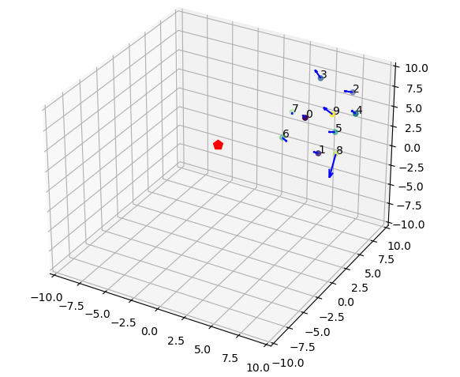

# 集群仿真


## 环境配置

运行环境为python3，需要安装如下包：

- numpy
- matplotlib

## 运行

### 程序功能

- sim_2d.py：是二维集群仿真
- sim_2d3d.py: 包括了二维和三维集群仿真，以及各种绘图方式控制

### 运行脚本

输入如下命令启动仿真脚本

```shell
$ python sim_2d3d.py
```

可以通过设置全局变量控制仿真效果，主要需要的全局变量如下：

- sim_dim：仿真维度根据需要进行设置，可选择2D或者3D
- num_agent：仿真智能体数量

- flag_draw_arrow_acc = False： 是否绘制智能体加速度向量

- flag_draw_arrow_vel = True：是否绘制智能体速度向量

- flag_draw_neighbor_line = False：是否绘制智能体与邻居节点的连线

## 运行效果

### 二维仿真效果


添加速度箭头后：


### 三维仿真效果


添加速度箭头


