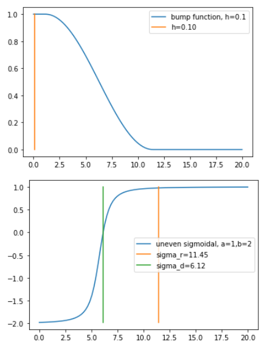

Olfati Saber算法详解

参考：

《Flocking For Multi-Agent Dynamic Systems:Algorithms and Theory》

**摘要:**

本文,我们将给出一个理论框架用于设计和分析分布式集群算法。

# 简介（Introduction）

# 预备知识（Preliminaries）

## 图和网络

图$G$是顶点和边$(\nu, \varepsilon)$组成的集合，其中顶点集合$\nu={1,2...,n}$，边的集合$\varepsilon \in \nu \times \nu$。

一个顶点$i$的邻居是所有与该顶点存在连接边的顶点集合，记为$N_i$：
$$
N_i=\{j\in \nu:a_{ij}\ne 0\}=\{j\in \nu:(i,j)\in \varepsilon\} \tag 1
$$

定义$r>0$为两个智能体之间的交互距离。那么一个半径为$r$的圆球可定义智能体$i$的一组邻居，表示为：
$$
N_i=\{j\in \nu:\left \|q_j - q_i  \right \| <r\}     \tag{3}
$$

> 注解：
>
> 任何一个智能体，只要距离智能体$i$小于$r$就代表$j$是$i$的邻居！距离使用向量的2范数表示。
>
> $r$在实际中的意义可表示为无线电通信距离，因为只有在通信距离内的邻居节点才能实现编队。

这个圆球内的边组成的集合表示为：
$$
\varepsilon (q)=\{(i,j)\in \nu \times \nu: \left \| q_j-q_i \right\|<r,i\ne j\} \tag 4
$$

## $\alpha$-Lattices and Quasi $\alpha$-Lattices

我们的目标之一是设计集群规则使编队内的所有动态智能体具备保持一定彼此间距的能力并能组成图$G(q)$。我们考虑如下约束：
$$
\left\| q_j-q_i \right\|-d , \forall j\in N_i(q) \tag{5}
$$
**定义1：**($\alpha$-lattice)，$\alpha$网格是满足约束(5)的结构$q$，我们使用$d$表示网格大小，$\kappa=r/d$表示网格比例。

**定义2：**(quasi $\alpha$-lattice)，伪$\alpha$网格是满足如下约束的结构q：
$$
-\delta \le \left\| q_j-q_i \right\|-d \le \delta, \forall (i,j)\in \varepsilon (q) \tag{5}
$$
这里$\delta$表示一种网格长度的不确定性，其远小于$d$。

> 由于智能体位置的动态变化，无法完全严格的组成大小为$d$的网格，故需要容忍网格大小有一定变动范围。

## Deviation Energy of Conformations

为了量化/评估网络的结构布局与$\alpha$-Lattice的差异，我们定义一个偏移能量为：
$$
E(q)=\frac{1}{|\varepsilon(q)|+1}\sum_{i=1}^{n}\sum_{j\in N_i} {\psi(\left\| q_j-q_i \right\|-d)} \tag{7}
$$
这里$\psi(z)=z^2$，叫做二元势函数（pairwise potential）。

> 注解：
>
> 可以想象两个智能体是有引力和斥力的物体，离着近了斥力大，离着远了引力大，只有距离合适，势能最小！
>
> 1. $\left\| q_j-q_i \right\|$：表示两个智能体之间的距离；
>2. $\psi(\left\| q_j-q_i \right\|-d)$：可以评估两个智能体之间与”设定距离$d$"的偏差！不管近了还是远了，都大于0，只有距离为$d$时能量为0！
> 3. 将网络内所有智能体和对应的“邻居”的势能进行累加！
>3. $|\varepsilon(q)|$表示边的数量

对于有$n$个粒子的系统，该偏移能量可看作是非平滑势能函数。非常有趣的是，$\alpha$-Lattice网络结构就是该函数的极小值，也就是能量最小。对于边长不确定度为$\delta$的伪$\alpha$-Lattice网络结构$q$来说，对应的偏移能量表示为：
$$
E(q)\le \frac{|\varepsilon(q)|}{|\varepsilon(q)|+1}\delta^2 \le \delta^2=\varepsilon^2 d^2, \quad \varepsilon<1
$$
也就是说，伪$\alpha$-Lattice网络结构是一直低能量的构型！

## $\sigma$-Norm and Bump Functions

定义一个新的向量范数为**$\sigma$-Norm**，它其实是一个映射（$\mathbb R^m \rightarrow \mathbb R_{\ge0}$）由$m$维空间到一个标量，定义为：
$$
\left \| z \right \|_{\sigma}=\frac{1}{\epsilon}[\sqrt{1+\epsilon \left \| z \right \|^2}-1] \tag 8
$$
> 这里$z$是参数变量。

其中参数$\epsilon>0$，并且其梯度$\sigma_{\epsilon}(z)=\bigtriangledown \left \| z \right \|_{\sigma}$，具体表示如下：
$$
\sigma_{\epsilon}(z)=\frac{z}{\sqrt{1+\epsilon \left \| z \right \|^2}}=\frac{z}{1+\epsilon \left \| z \right \|_{\sigma}} \tag 9
$$
在本文中参数$\epsilon$的值是固定的！

> - $\left \| z \right \|_{\sigma}$分析
>
> 该曲线是一个"抛物线"
>
> 
>
> - $\sigma_{\epsilon}(z)$分析
>
> 取值范围是[-1,1]，不同的参数$\epsilon$只会改变曲线的陡峭性，不会改变取值范围。

> 当$\epsilon=1$时，$\sigma_{1}(z)$曲线图如下：

> 
>
> 当$\epsilon=0.1$时，$\sigma_{0.1}(z)$曲线图如下：
>
> 

**Bump Function**是一个标量函数$\rho_h(z)$，在0和1之间平滑过渡。

可选择如下：
$$
\rho_h(z)=
\begin{cases}
  1 & z\in[0,h)\\
  \frac{1}{2}[1+cos(\pi\frac{(z-h)}{(1-h)})], &z\in[h,1]\\
  0 & 其他
\end{cases} \tag{10}\label{eq10}
$$

当$h=0.3$时如下图：

> 注解：
>
> 可以看到，当$z\rightarrow h$时，$\rho_h(z)=1/2[1+cos(0)]$接近于1，当$z\rightarrow 1$时，$\rho_h(z)=1/2[1+cos(\pi)]$接近于0。
>
> 这个函数就是将输入映射到$[0,1]$区间，且保证了可导！

这里参数$h\in (0,1)$。可见这是一个$C^1-smooth$函数，在区间$[1,\infin)$其导数为0即${\rho _i}'(z)=0$

通过该bump函数，我们对邻接矩阵的元素重新进行变换，如下：
$$
a_{ij}(q)=\rho_h(\left\| q_j-q_i \right\|_\sigma / r_\alpha) \in [0,1], \quad j \ne i                                            \tag {11}
$$
这里$r_\alpha=\left\| r \right\|_\sigma$，并且对于任何$i,q$都有$a_{ii}(q)=0$。通过这个bump函数，我们就可以得到一个网络，其元素都在0~1范围。

> 注解：
>
> 后面章节中，邻接矩阵中的元素都是通过bump函数处理得到的

## 总体势能函数Collective Potential Functions

总体势能函数$V(q)$是一个非负函数，映射$V:\mathbb R^{mn} \rightarrow \mathbb R_{\ge0}$，这个函数的局部最小与代数公式(5)的约束条件是近似相等的！在本文中，总体势能函数是偏移能量函数的平滑版本，总体势能函数中包括了一个有限截至区间的标量二元势函数。这意味着，存在一个有限交互距离$r$，使得$\psi'(z)=0,\forall z\ge r$。这个是我们的集群算法可扩展性的基础性质。

定义$\psi(z): \mathbb R_{\ge0} \rightarrow \mathbb R_{\ge0}$是具备引力/斥力的二元势函数，其全局最优解为$z=d$。

那么总体势能函数$\varphi(q)$表示如下公式：
$$
\varphi(q)=\frac{1}{2}\sum_{i}\sum_{j\ne i}\psi(\left\| q_j-q_i \right\|-d)                    \tag{12}
$$
但当有两个不同的节点位置重合时（也即$q_j=q_i$）这个函数不可导！

我们将公式(5)使用$\sigma$-Norm形式重新写：
$$
\left\| q_j-q_i \right\|_\sigma=d_\alpha,\quad \forall j \in N_i(q)                               \tag{13}
$$
这里$d_\alpha=\left\| d \right\|_\sigma$。基于这些约束推导出一个平滑的总体势能函数形式为：
$$
V(q)=\frac{1}{2}\sum_{i}\sum_{j\ne i}\psi_{\alpha}(\left\| q_j-q_i \right\|_\sigma)               \tag{14}
$$
其中，$\psi_{\alpha}(z)$是一个平滑的二元势函数（公式$\eqref{eq16}$），有限界限点为$r_\alpha=\left\| r \right\|_\sigma$，全局最小值为$z=d_\alpha$。

为了构造这个具备有限界限的平滑二元势函数，我们定义一个action函数$\phi_\alpha(z)$：
$$
\phi_\alpha(z)=\rho_h(z/r_\alpha)\phi(z-d_\alpha)\\
\phi(z)=\frac{1}{2}[(a+b)\sigma_1(z+c)+(a-b)]                                      \tag{15}\label{eq15}
$$
这里$\sigma_1(z)=z/\sqrt{1+z^2}$，并且$\phi(z)$是非偶-sigmoid函数(uneven sigmoidal function)，参数满足$0<a\le b$，$c=|a-b|/\sqrt{4ab}$。那么公式(14)中定义的二元势函数表示为：
$$
\psi_{\alpha}(z)=\int_{d_\alpha}^{z} \phi_\alpha(s)ds                                           \tag{16}\label{eq16}
$$
其中，函数曲线分别表示为：

> 注解：
>
> **potential function意义**：
>
> 二元势函数$\psi_{\alpha}(z)$其实就是一个势能函数，输入$z$的含义是智能体与其他智能体之间的距离，距离太近和太远势能都比较高，只有在一定位置时势能才最低，这就是二元势的含义！势能高表示排斥力，势能低表示吸引力。
>
> 集群算法会使智能体在“高势能”位置移动至“低势能”位置，最后停留在势能最低点，从而实现了智能体距离保持在一定位置。
>
> **action function意义**：
>
> $\phi_\alpha(z)$函数是$\psi_{\alpha}(z)$的导数，给定了智能体要到达最小势能位置的移动方向和大小！
>
> 其中$\phi_\alpha(z=d_\alpha)=0$：也就是当距离$d>d_\alpha$时，$\phi_\alpha>0$，表现为引力，智能体相向运动！当距离$d<d_\alpha$时，$\phi_\alpha<0$，表现为斥力，智能体相反运动！
>
> 其中$\phi_\alpha(z\ge r_\alpha)=0$：也就是当距离过大，大于$r_\alpha$时，引力和斥力就消失了，智能体不做运动。
>

**action function分析**

根据公式$\eqref{eq15}$，可以知道action function曲线是由bump function曲线与uneven sigmoidal function曲线相乘得到。

- bump function

参见$\eqref{eq10}$

- uneven sigmoidal function
  - a: 由于$\sigma_{\epsilon}(z)$上限是1，故uneven sigmoidal function上限是$a$；
  - b: 由于$\sigma_{\epsilon}(z)$下限是-1，故uneven sigmoidal function下限是$-b$；
  - 参数$c$的取值，令$\phi(z)=0$，可以得到$c=|a-b|/\sqrt{(4ab)}$。

$\phi(z)$(uneven sigmoidal function)的曲线图如下：

下图是两个曲线：

> 由于输入参数为$z/r_\alpha$，故这里bump function曲线横向进行了放大，最小位置由1->$r_\alpha$；
>
> 由于输入参数为$z-d_\alpha$，故这里uneven sigmoidal function曲线进行了右移，中心点由0->$d_\alpha$。

两个曲线相乘得到action function曲线如下：

**总结：**

总的来说，作者其实最先想到的应该是总体势能函数曲线，因为当希望两个agent之间的距离（$z=\left\| q_j-q_i \right\|$）大于$d$时表现为吸引力，小于$d$时表现为排斥力，故该曲线就是一个凹线，最小值就在$z=d$处；

那么根据想象好的总体势能函数曲线，可以画出它的求导后的曲线，即action函数曲线，它肯定是在$z=d$处为0，$z<d$处为负，$z>d$处为正，但 $z$很大时也为0。进一步，作者将尝试构造action曲线函数！

## 各参数的意义

### d和r的意义

> **$d$的意义**：
>
> - 二元势函数曲线中，势能最低处为$\sigma$-Norm(d)即$d_\alpha$；
> - 智能体之间距离保持为d！
>
> **$r$的意义**：
>
> - 二元势函数的有效区间为[0, $\sigma$-Norm(r)]即[0,$r_\alpha$]，也就是智能体之间距离在$r_\alpha$外时势能都是一样的，导数为0，故引力和斥力的影响只在有效区间内！
> - 通过r确定邻居！
>
> **不同参数的影响：**
>
> 参数d=4，r=6时函数曲线如下图：

> 
>
> 
>
> 
>
> 参数d=4，r=10时函数曲线如下图：
>
> 
>
> 
>
> 
>

### a和b的意义
>**$a$的意义:**
> 
>增加$a$，可以增加两个智能体之间的吸引力（二者需要$r$距离内），反之减小吸引力。
> 
>**$b$的意义：**
> 
>增加$b$，可以增加两个智能体之间的排斥力，反之减小排斥力。
> 
>下图是不同$a,b$的影响：
> 
>
> 
>

# 集群算法Flocking Algorithms for Free-Space

在本章节，我们给出了一系列自由空间中集群分布式控制算法，或叫做自由集群（具备障碍物避撞功能的集群算法在第七节描述）。我们将使用运动方程$\ddot{q}_i=u_i$的物理智能体叫做$\alpha-agent$。这里$\alpha-agents$对应飞鸟等集群中的成员,这个术语用来与后面讲到的物理agents和确定的虚拟agents进行区分. 非正式的说，$\alpha-agent$有一个保存与周围其他智能体一定距离$d>0$的趋势（也就是 $\alpha-lattice$背后的含义）。在自由集群中，每个智能体的控制输入包含如下三项：
$$
u_i=f_i^g + f_i^d + f_i^\gamma                               \tag{23}
$$
这里$f_i^g=-\bigtriangledown_{q_i} V(q)$是梯度项，$f_i^d$是速度一致项，表现为阻尼力，$f_i^\gamma$为导航反馈，由集群目标决定。集群目标可以是飞行至期望位置，或者集体穿过只有很少出口的拥挤区域。我们提出了两种分布式算法用于在$\mathbb{R}^m$空间（空间维度是1、2或3）的集群运动控制。

> 注解：
>
> $u_i$就是第$i$个智能体的加速度！以下两个算法就是计算集群中每个智能体的加速度，通过控制每个智能体的加速度达到集群控制效果。

## 算法一

公式为：$u_i=u_i^\alpha$，其中
$$
u_i^{\alpha}=\sum_{j\in N_i} \phi_\alpha(\left\| q_j-q_i \right\|_\sigma)\bold{n}_{ij} + \sum_{j\in N_i}a_{ij}(q)(p_j-p_i) \tag{24}
$$

这里$\bold {n}_{ij}$是一个连接$q_i$到$q_j$的向量：
$$
\bold {n}_{ij} = \sigma_\epsilon(q_j-q_i)=\frac{q_j-q_i}{\sqrt{1+\epsilon \left\| q_j-q_i \right\|^2}}  \tag{25}
$$

并且，$0<\epsilon<1$，是$\sigma$-Norm的一个固定参数。算法一没有导航反馈，可以理解为是$(\alpha,\alpha)$集群协议，因为它描述了两个$\alpha-agent$之间的交互规则。

> 注解：
>
> 1. 对于第一项$\sum_{j\in N_i} \phi_\alpha(\left\| q_j-q_i \right\|_\sigma)\bold{n}_{ij}$：
>
>    这个就是总体势能函数在智能体$i$处的导数！参考公式(14)，求导有：
>    $$
>    \bigtriangledown_{q_i} V(q)
>      =\frac{1}{2}\sum_{j\ne i} \frac{\partial  \psi_{\alpha}(\left\| q_j-q_i \right\|_\sigma) }{\partial q_i} \\
>      =\frac{1}{2}\sum_{j\ne i} \phi_\alpha{(\left\| q_j-q_i \right\|_\sigma)} \frac{\partial \left\| q_j-q_i \right\|_\sigma}{\partial q_i} \\
>      =\frac{1}{2}\sum_{j\ne i} \phi_\alpha{(\left\| q_j-q_i \right\|_\sigma)} \sigma_\epsilon(q_j-q_i)(-1)\\
>      =-\frac{1}{2}\sum_{j\ne i} \phi_\alpha{(\left\| q_j-q_i \right\|_\sigma)}\bold{n}_{ij}
>    $$
>    由于无人机的运动方向应该朝向梯度的反方向，也就是：
>    $$
>    -\bigtriangledown_{q_i} V(q)=\frac{1}{2}\sum_{j\ne i} \phi_\alpha{(\left\| q_j-q_i \right\|_\sigma)}\bold{n}_{ij}
>    $$
>
>
> 2. 对于第二项$\sum_{j\in N_i}a_{ij}(q)(p_j-p_i)$：
>
>    因为要保持速度一致性，故如果其他无人机速度快，也就是$p_j-p_i>0$，那么就需要加速！反之，减速。
>

## 算法二

公式为：$u_i=u_i^\alpha+u_i^\gamma$，进一步表示为
$$
u_i=\sum_{j\in N_i} \phi_\alpha(\left\| q_j-q_i \right\|_\sigma)\bold{n}_{ij} + \sum_{j\in N_i}a_{ij}(q)(p_j-p_i) \tag{24}+f_i^\gamma(q_i,p_i)
$$
这里$u_i^\gamma$为导航反馈，公式如下：
$$
u_i^\gamma=f_i^\gamma(q_i,p_i,q_r,p_r)=-c_1 * (q_i-q_r) - c_2 * (p_i-p_r),\quad c_1,c_2 > 0 \tag{27}
$$

> 注解：
>
> 1. 这个公式其实就是根据期望位置和期望速度计算期望加速度，等同于：
>
>    $u_i^\gamma=c_1 * (q_r-q_i) + c_2 * (p_r-p_i)$
>
> 2. 参数$c_1$、$c_2$的选择比较重要，不能太大，如果太大，导致飞到期望位置点的力量太强，强过了无人机彼此之间的斥力，会导致无人机相撞。

用$(q_\gamma,p_\gamma)$来表示$\gamma-agent$的状态，$\gamma-agent$是动态/静态agent，用来描述集群目标期望。

**Remark 5.** 事实上，只有在一定非常严格的初始条件下规则（24）才可以实现集群控制，对于大多数初始条件，或者规模较大的集群（包含的agent数量>10时），（24）通常无法实现集群控制，反而导致整个集群破碎为多个小集群而互相分离。相比来说，（26）不会导致集群分离情况，所以算法二是一个真正的集群算法，算法一只是为了更好的对算法二进行理解而已。
